# Class Diagram - As-Built (DESIGN-01)

Dibuat setelah slice Auth (AUTH-01/AUTH-02) dan dua slice pertama Master Data
(Kategori, Gudang) stabil. Hanya memuat kelas yang **benar-benar ada di
kode** saat ini - modul yang belum dikerjakan (Produk, Supplier, Customer,
Purchase Order, Sales Order, Stock Ledger, Dashboard, Laporan) sengaja tidak
digambar di sini supaya diagram ini tidak berbohong soal apa yang sudah
selesai; diagram initial (`docs/planning/class-diagram-initial.md`) tetap
jadi acuan rencana untuk modul-modul itu.

**Cara baca penanda dependency** (wajib DESIGN-01: dependency ke interface vs ke kelas konkret harus beda tanda):
- `X ..|> Y` (panah putus-putus, kepala berongga) = **realisasi interface** - `Y` adalah interface, `X` salah satu implementasinya.
- `X --> Y : constructor injection (interface)` = `X` bergantung ke **abstraksi** `Y` (bisa diganti implementasinya tanpa mengubah `X`).
- `X --> Y : constructor injection (concrete)` = `X` bergantung langsung ke **kelas konkret** `Y` (belum/tidak perlu diabstraksi - cuma ada satu kemungkinan implementasi).
- `X ..> Y : throws` / `X ..> Y : catches` = dependency ke exception, bukan constructor injection.

## Diagram A - Cross-cutting: Session & Routing

```mermaid
classDiagram
    direction LR

    class SessionInterface {
        <<interface>>
        +get(string key) mixed
        +set(string key, mixed value) void
        +remove(string key) void
        +destroy() void
        +regenerateId() void
    }

    class PhpSessionAdapter {
        +get(string key) mixed
        +set(string key, mixed value) void
        +remove(string key) void
        +destroy() void
        +regenerateId() void
    }

    class Role {
        <<enumeration>>
        Admin
        Sales
        WarehouseStaff
    }

    class CurrentUser {
        +int id
        +string name
        +Role role
    }

    class AuthGuard {
        -SessionInterface session
        +requireLogin() CurrentUser
        +requireRole(CurrentUser user, Role[] allowed) void
    }

    class Router {
        -array routes
        -CsrfToken csrf
        +get(string pattern, callable handler) void
        +post(string pattern, callable handler) void
        +dispatch(string method, string path) void
    }

    class CsrfToken {
        -SessionInterface session
        +get() string
        +isValid(string? submitted) bool
    }

    SessionInterface <|.. PhpSessionAdapter : implements
    AuthGuard --> SessionInterface : constructor injection (interface)
    AuthGuard --> CurrentUser : creates
    CurrentUser --> Role
    Router --> CsrfToken : constructor injection (concrete)
    CsrfToken --> SessionInterface : constructor injection (interface)

    note for CurrentUser "BEDA dari initial: ada properti `name`\n(initial cuma id+role) - dibutuhkan\nsupaya sidebar bisa menampilkan\nnama user yang login, bukan cuma role"
    note for Router "TIDAK ADA di diagram initial sama sekali.\nDitambahkan karena PHP tidak ada routing\nbawaan dan Category/Warehouse/Product\nsemua butuh URL /resource/{id}/edit -\nregex sederhana, tanpa dependency."
    note for CsrfToken "TIDAK ADA di diagram initial (initial dibuat\nsebelum CSRF disadari sebagai celah - lihat\ndocs/quality/tech-debt.md #4). Dicek satu kali\ndi Router::dispatch() untuk semua route POST,\nbukan diulang manual di tiap Controller."
```

## Diagram B - Auth (AUTH-01, AUTH-02)

```mermaid
classDiagram
    direction LR

    class User {
        +int? id
        +string name
        +string email
        +string passwordHash
        +Role role
        +bool isActive
        +verifyPassword(string plain) bool
    }

    class UserRepositoryInterface {
        <<interface>>
        +findById(int id) User?
        +findByEmail(string email) User?
    }
    class MySqlUserRepository {
        -PDO pdo
    }

    class AuthService {
        -UserRepositoryInterface users
        +authenticate(string email, string password) User?
    }

    class AuthController {
        -AuthService authService
        -SessionInterface session
        +showLoginForm() void
        +login() void
        +logout() void
    }

    User --> Role
    UserRepositoryInterface <|.. MySqlUserRepository : implements
    AuthService --> UserRepositoryInterface : constructor injection (interface)
    AuthController --> AuthService : constructor injection (concrete)
    AuthController --> SessionInterface : constructor injection (interface)

    note for User "BEDA dari initial: tidak ada properti\ncreatedAt/updatedAt di Entity (kolomnya\nada di tabel `users`, tapi belum ada\nalur yang butuh baca nilainya di PHP -\nYAGNI, sama alasannya dengan\nUserRepositoryInterface di ADR-0001)"
    note for UserRepositoryInterface "Sesuai ADR-0001: sengaja BELUM\npunya save()/listPaginated() -\nditunda sampai USR-01 (manajemen\nuser) benar-benar dikerjakan"
    note for AuthController "BEDA dari initial: method tidak menerima\nRequest / mengembalikan Response - initial\ndiagram mengasumsikan abstraksi itu, tapi\nkodenya baca $_POST/$_GET langsung dan\npanggil header()/require view langsung.\nBerlaku utk semua Controller di as-built ini,\nbukan cuma AuthController."
```

## Diagram C - Master Data: Kategori (PRD-01 sebagian - baru Category yang dibangun)

```mermaid
classDiagram
    direction LR

    class Category {
        +int? id
        +string name
        +string? description
    }

    class CategoryRepositoryInterface {
        <<interface>>
        +findById(int id) Category?
        +save(Category category) Category
        +listAll(string? search, int limit, int offset, string sortBy, string sortDir) Category[]
        +countAll(string? search) int
        +isInUse(int id) bool
        +delete(int id) void
    }
    class MySqlCategoryRepository {
        -PDO pdo
    }
    class InMemoryCategoryRepository {
        -Category[] categories
        -array inUseIds
    }

    class CategoryService {
        +const PER_PAGE = 10
        -CategoryRepositoryInterface categories
        +listCategories(string? search, int page, int perPage, string sortBy, string sortDir) Category[]
        +countCategories(string? search) int
        +getCategoryById(int id) Category
        +createCategory(string name, string? description) Category
        +updateCategory(int id, string name, string? description) Category
        +deleteCategory(int id) void
    }

    class CategoryController {
        +const ALLOWED_PER_PAGE
        +const ALLOWED_SORT_COLUMNS
        +const STATUS_MESSAGES
        -CategoryService categoryService
        -AuthGuard guard
        +index() void
        +showCreateForm() void
        +create() void
        +showEditForm(string id) void
        +update(string id) void
        +delete(string id) void
    }

    class NotFoundException {
        <<exception>>
    }
    class ValidationException {
        <<exception>>
        -array errors
        +errors() array
    }
    class ConflictException {
        <<exception>>
    }

    CategoryRepositoryInterface <|.. MySqlCategoryRepository : implements
    CategoryRepositoryInterface <|.. InMemoryCategoryRepository : implements
    CategoryService --> CategoryRepositoryInterface : constructor injection (interface)
    CategoryController --> CategoryService : constructor injection (concrete)
    CategoryController --> AuthGuard : constructor injection (concrete)
    CategoryService ..> NotFoundException : throws
    CategoryService ..> ValidationException : throws
    CategoryService ..> ConflictException : throws
    CategoryController ..> ConflictException : catches
    CategoryController ..> ValidationException : catches

    note for CategoryRepositoryInterface "BEDA besar dari initial: initial cuma\nsketsa findById/save (pola generik lewat\nProduct di Diagram 0). Method search/sort/\npagination/isInUse/delete ditambahkan karena\nKategori sengaja dijadikan template FIND-01\nlebih awal dari Produk (permintaan user),\ndan karena Kategori (beda dari Produk/\nSupplier/Customer) di-hard-delete, bukan\ndinonaktifkan - schema-nya memang tanpa\nkolom is_active."
    note for ConflictException "TIDAK ADA di diagram initial sama sekali.\nDitambahkan untuk kasus 'aksi ditolak\naturan bisnis' (kategori masih dipakai\nproduk) - beda dari ValidationException\n(kesalahan input form) dan NotFoundException\n(data tidak ada)."
```

## Diagram D - Master Data: Gudang (WH-01)

```mermaid
classDiagram
    direction LR

    class Warehouse {
        +int? id
        +string name
        +string? location
        +bool isActive
    }

    class WarehouseRepositoryInterface {
        <<interface>>
        +findById(int id) Warehouse?
        +save(Warehouse warehouse) Warehouse
        +listAll(string? search, bool? isActive, int limit, int offset, string sortBy, string sortDir) Warehouse[]
        +countAll(string? search, bool? isActive) int
        +setActive(int id, bool isActive) void
    }
    class MySqlWarehouseRepository {
        -PDO pdo
    }
    class InMemoryWarehouseRepository {
        -Warehouse[] warehouses
    }

    class WarehouseService {
        +const PER_PAGE = 10
        -WarehouseRepositoryInterface warehouses
        +listWarehouses(string? search, bool? isActive, int page, int perPage, string sortBy, string sortDir) Warehouse[]
        +countWarehouses(string? search, bool? isActive) int
        +getWarehouseById(int id) Warehouse
        +createWarehouse(string name, string? location) Warehouse
        +updateWarehouse(int id, string name, string? location) Warehouse
        +setActive(int id, bool isActive) void
    }

    class WarehouseController {
        +const ALLOWED_PER_PAGE
        +const ALLOWED_SORT_COLUMNS
        +const STATUS_FILTERS
        +const STATUS_MESSAGES
        -WarehouseService warehouseService
        -AuthGuard guard
        +index() void
        +showCreateForm() void
        +create() void
        +showEditForm(string id) void
        +update(string id) void
        +toggleActive(string id) void
    }

    WarehouseRepositoryInterface <|.. MySqlWarehouseRepository : implements
    WarehouseRepositoryInterface <|.. InMemoryWarehouseRepository : implements
    WarehouseService --> WarehouseRepositoryInterface : constructor injection (interface)
    WarehouseController --> WarehouseService : constructor injection (concrete)
    WarehouseController --> AuthGuard : constructor injection (concrete)
    WarehouseService ..> NotFoundException : throws
    WarehouseService ..> ValidationException : throws
    WarehouseController ..> ValidationException : catches

    note for WarehouseRepositoryInterface "BEDA sengaja dari CategoryRepositoryInterface\n(Diagram C): tidak ada isInUse()/delete() -\nada dimensi filter `isActive` di listAll/countAll\ndan method setActive() sebagai gantinya. Gudang\nmemang punya kolom is_active di schema (Kategori\ntidak) - lihat ADR-0004."
    note for WarehouseService "setActive() TIDAK melempar ConflictException\nseperti CategoryService::deleteCategory() -\ntoggle status tidak pernah berisiko merusak\nreferensi data lain (baris tetap ada), beda\ndari hard-delete yang butuh pengecekan pemakaian."
```

## Apa yang berubah dari initial ke as-built, dan kenapa

1. **`CurrentUser` bertambah properti `name`.** Initial hanya menyiapkan `id`+`role` untuk kebutuhan otorisasi (`requireRole()`); kebutuhan menampilkan *siapa* yang login (bukan cuma perannya) di sidebar baru muncul belakangan, jadi properti ini ditambah begitu use case-nya nyata - bukan diprediksi di awal.
2. **`Router` (class konkret baru) tidak pernah digambar di initial.** Diagram initial mengasumsikan Controller menerima objek `Request` generik tanpa menjelaskan bagaimana request itu sampai ke method yang tepat. Begitu coding dimulai, dibutuhkan mekanisme routing nyata (terutama untuk URL dengan parameter seperti `/categories/{id}/edit`) - ditambahkan sebagai kelas manual sederhana (regex, tanpa dependency), bukan lewat framework routing.
3. **Semua Controller ternyata tidak menerima `Request` atau mengembalikan `Response`.** Ini penyederhanaan yang baru terlihat perlu saat coding: PHP native sudah punya `$_GET`/`$_POST`/`header()` sebagai boundary HTTP, jadi menambah lapisan `Request`/`Response` buatan sendiri tidak menyelesaikan masalah nyata (melanggar semangat "jangan over-engineer" di brief) - Controller cukup baca superglobal langsung dan panggil `header()`/`require` view.
4. **`CategoryRepositoryInterface` jauh lebih kaya dari sketsa initial.** Initial hanya mencontohkan pola generik (findById/save/searchPaginated lewat `Product`). Begitu Kategori benar-benar dikerjakan, method search/sort/pagination (`listAll`, `countAll`) dan `isInUse`/`delete` ditambahkan - dua yang terakhir karena Kategori ternyata satu-satunya master data yang di-*hard delete* (bukan dinonaktifkan seperti Produk/Supplier/Customer di §1.3), sehingga butuh pengecekan pemakaian sebelum dihapus.
5. **`ConflictException` (exception baru) tidak ada di initial.** Diagram initial hanya menyiapkan `ValidationException` (kesalahan input) dan `NotFoundException` (data tidak ada). Kasus "aksi ditolak karena aturan bisnis" (kategori masih dipakai produk lain) adalah kondisi ketiga yang berbeda dari keduanya, jadi ditambahkan sebagai exception tersendiri mengikuti pola yang sama.
6. **`CsrfToken` (class baru) tidak ada di initial maupun di draf as-built pertama.** CSRF baru disadari sebagai celah nyata setelah slice Kategori selesai (tercatat di `docs/quality/tech-debt.md` #4) - ditambahkan sebagai dependency `Router`, bukan diperiksa manual di tiap Controller, supaya tidak ada endpoint POST yang lolos karena lupa ditambahkan satu per satu.
7. **`WarehouseRepositoryInterface` sengaja punya bentuk berbeda dari `CategoryRepositoryInterface`**, bukan cuma disalin lalu di-rename. Gudang punya kolom `is_active` di schema (Kategori tidak), jadi repository-nya punya dimensi filter status + `setActive()`, menggantikan `isInUse()`/`delete()` milik Kategori - lihat ADR-0004 untuk alasan lengkap kenapa dua entity Master Data yang polanya mirip ini justru sengaja dibuat tidak seragam.
