# Class Diagram - As-Built (DESIGN-01)

Ditulis progresif: setiap diagram ditambahkan begitu slice-nya selesai dan
stabil, bukan digambar sekaligus di akhir. Sekarang mencakup **seluruh modul
yang dibangun** - Diagram A-B (cross-cutting & Auth), C-F (Master Data:
Kategori, Gudang, Supplier/Customer, Produk & Stok), G (Purchase Order &
Goods Receipt), H (Manajemen User), I (Sales Order & Goods Issue), dan J
(Dashboard & Laporan).

Aturan yang dijaga sepanjang dokumen ini: hanya memuat kelas yang **benar-benar
ada di kode**, dengan signature dan arah dependency sesuai file aslinya -
diagram initial (`docs/planning/class-diagram-initial.md`) tetap jadi arsip
rencana awal, dan perbedaan antara keduanya dirangkum di bagian terakhir
("Apa yang berubah dari initial ke as-built, dan kenapa").

**Cara baca penanda dependency** (wajib DESIGN-01: dependency ke interface vs ke kelas konkret harus beda tanda):
- `X ..|> Y` (panah putus-putus, kepala berongga) = **realisasi interface** - `Y` adalah interface, `X` salah satu implementasinya.
- `X --> Y : constructor injection (interface)` = `X` bergantung ke **abstraksi** `Y` (bisa diganti implementasinya tanpa mengubah `X`).
- `X --> Y : constructor injection (concrete)` = `X` bergantung langsung ke **kelas konkret** `Y` (belum/tidak perlu diabstraksi - cuma ada satu kemungkinan implementasi).
- `X ..> Y : throws` / `X ..> Y : catches` = dependency ke exception, bukan constructor injection.

## Diagram A - Cross-cutting: Session & Routing

```mermaid
classDiagram
    direction LR

    class SessionInterface {
        <<interface>>
        +get(string key) mixed
        +set(string key, mixed value) void
        +remove(string key) void
        +destroy() void
        +regenerateId() void
    }

    class PhpSessionAdapter {
        +get(string key) mixed
        +set(string key, mixed value) void
        +remove(string key) void
        +destroy() void
        +regenerateId() void
    }

    class Role {
        <<enumeration>>
        Admin
        Sales
        WarehouseStaff
    }

    class CurrentUser {
        +int id
        +string name
        +Role role
    }

    class AuthGuard {
        -SessionInterface session
        -UserRepositoryInterface users
        +requireLogin() CurrentUser
        +requireRole(CurrentUser user, Role[] allowed) void
    }

    class Router {
        -array routes
        -CsrfToken csrf
        +get(string pattern, callable handler) void
        +post(string pattern, callable handler) void
        +dispatch(string method, string path) void
    }

    class SendsRedirects {
        <<trait>>
        -redirect(string url) never
    }

    class NormalizesSearchTerm {
        <<trait>>
        -normalizeSearch(string? search) string?
    }

    class CsrfToken {
        -SessionInterface session
        +get() string
        +isValid(string? submitted) bool
    }

    SessionInterface <|.. PhpSessionAdapter : implements
    AuthGuard --> SessionInterface : constructor injection (interface)
    AuthGuard --> UserRepositoryInterface : constructor injection (interface)
    AuthGuard --> CurrentUser : creates
    CurrentUser --> Role
    Router --> CsrfToken : constructor injection (concrete)
    CsrfToken --> SessionInterface : constructor injection (interface)

    note for SendsRedirects "Dipakai 9 Controller (Auth, Category, Customer, Product,\nPurchaseOrder, SalesOrder, Supplier, User, Warehouse).\nSatu-satunya cara Controller mengirim redirect - method\nbertipe `never` membuat `exit` tidak mungkin terlupa,\nkarena `header()` sendiri TIDAK menghentikan eksekusi.\nLihat refactor-log #8."
    note for NormalizesSearchTerm "Dipakai 8 Service. Merapikan kata kunci pencarian\n(trim, string kosong jadi null) supaya Repository bisa\nmembedakan 'tanpa filter' dari 'cari string kosong'.\nPurchaseOrderService/SalesOrderService meng-alias method\nini karena punya aturan tambahan membuang awalan\nPO-/SO-. Lihat refactor-log #6."

    note for CurrentUser "BEDA dari initial: ada properti `name`\n(initial cuma id+role) - dibutuhkan\nsupaya sidebar bisa menampilkan\nnama user yang login, bukan cuma role"

    note for AuthGuard "Session HANYA menyimpan user_id; nama dan role\ndibaca ulang dari UserRepositoryInterface tiap request.\nSemula ketiganya disimpan di session, sehingga akun yang\ndinonaktifkan Admin tetap berhak penuh sampai ia logout\nsendiri - untuk sistem dengan segregation of duties (SS1.2)\npencabutan akses harus langsung berlaku."
    note for Router "TIDAK ADA di diagram initial sama sekali.\nDitambahkan karena PHP tidak ada routing\nbawaan dan Category/Warehouse/Product\nsemua butuh URL /resource/{id}/edit -\nregex sederhana, tanpa dependency."
    note for CsrfToken "TIDAK ADA di diagram initial (initial dibuat\nsebelum CSRF disadari sebagai celah - lihat\ndocs/quality/tech-debt.md #4). Dicek satu kali\ndi Router::dispatch() untuk semua route POST,\nbukan diulang manual di tiap Controller."
```



## Diagram B - Auth (AUTH-01, AUTH-02)

```mermaid
classDiagram
    direction LR

    class User {
        +int? id
        +string name
        +string email
        +string passwordHash
        +Role role
        +bool isActive
        +verifyPassword(string plain) bool
    }

    class UserRepositoryInterface {
        <<interface>>
        +findById(int id) User?
        +findByEmail(string email) User?
    }
    class MySqlUserRepository {
        -PDO pdo
    }

    class AuthService {
        -UserRepositoryInterface users
        +authenticate(string email, string password) User?
    }

    class AuthController {
        -AuthService authService
        -SessionInterface session
        +showLoginForm() void
        +login() void
        +logout() void
    }

    User --> Role
    UserRepositoryInterface <|.. MySqlUserRepository : implements
    AuthService --> UserRepositoryInterface : constructor injection (interface)
    AuthController --> AuthService : constructor injection (concrete)
    AuthController --> SessionInterface : constructor injection (interface)

    note for User "BEDA dari initial: tidak ada properti\ncreatedAt/updatedAt di Entity (kolomnya\nada di tabel `users`, tapi belum ada\nalur yang butuh baca nilainya di PHP -\nYAGNI, sama alasannya dengan\nUserRepositoryInterface di ADR-0001)"
    note for UserRepositoryInterface "Sesuai ADR-0001: awalnya sengaja BELUM\npunya save()/listPaginated(), ditunda sampai\nUSR-01 benar-benar dikerjakan. Method itu\nsudah ditambahkan (save/setActive/listAll/\ncountAll) begitu USR-01 dibangun - lihat\nDiagram H, bukan diagram ini, supaya diagram\nAuth tetap fokus ke alur login."
    note for AuthController "BEDA dari initial: method tidak menerima\nRequest / mengembalikan Response - initial\ndiagram mengasumsikan abstraksi itu, tapi\nkodenya baca $_POST/$_GET langsung dan\npanggil header()/require view langsung.\nBerlaku utk semua Controller di as-built ini,\nbukan cuma AuthController."
```



## Diagram C - Master Data: Kategori (PRD-01)


## Diagram D - Master Data: Gudang (WH-01)


## Diagram E - Master Data: Supplier & Customer (§1.3, keduanya identik strukturnya)

Didemonstrasikan sekali pakai `Supplier` sebagai contoh, mengikuti gaya yang
sama dengan Diagram 0 di diagram initial. `Customer` (`App\Entity\Customer`,
`CustomerRepositoryInterface`, `MySqlCustomerRepository`,
`InMemoryCustomerRepository`, `CustomerService`, `CustomerController`)
adalah kelas-kelas terpisah dengan nama tabel (`customers`) dan pesan
Indonesia yang berbeda ("Customer" bukan "Supplier"), tapi bentuk method,
constant, dan relasinya identik satu-satu dengan yang digambar di sini -
tidak digambar ulang di sini supaya tidak duplikatif.

```mermaid
classDiagram
    direction LR

    class Supplier {
        +int? id
        +string name
        +string? contact
        +string? address
        +bool isActive
    }

    class SupplierRepositoryInterface {
        <<interface>>
        +findById(int id) Supplier?
        +save(Supplier supplier) Supplier
        +listAll(string? search, bool? isActive, int limit, int offset, string sortBy, string sortDir) Supplier[]
        +countAll(string? search, bool? isActive) int
        +setActive(int id, bool isActive) void
    }
    class MySqlSupplierRepository {
        -PDO pdo
    }
    class InMemorySupplierRepository {
        -Supplier[] suppliers
    }

    class SupplierService {
        +const PER_PAGE = 10
        -SupplierRepositoryInterface suppliers
        +listSuppliers(string? search, bool? isActive, int page, int perPage, string sortBy, string sortDir) Supplier[]
        +countSuppliers(string? search, bool? isActive) int
        +getSupplierById(int id) Supplier
        +createSupplier(string name, string? contact, string? address) Supplier
        +updateSupplier(int id, string name, string? contact, string? address) Supplier
        +setActive(int id, bool isActive) void
    }

    class SupplierController {
        -const ALLOWED_PER_PAGE
        -const ALLOWED_SORT_COLUMNS
        -const STATUS_FILTERS
        -const STATUS_MESSAGES
        -SupplierService supplierService
        -AuthGuard guard
        +index() void
        +showCreateForm() void
        +create() void
        +showEditForm(string id) void
        +update(string id) void
        +toggleActive(string id) void
    }

    SupplierRepositoryInterface <|.. MySqlSupplierRepository : implements
    SupplierRepositoryInterface <|.. InMemorySupplierRepository : implements
    SupplierService --> SupplierRepositoryInterface : constructor injection (interface)
    SupplierController --> SupplierService : constructor injection (concrete)
    SupplierController --> AuthGuard : constructor injection (concrete)
    SupplierService ..> NotFoundException : throws
    SupplierService ..> ValidationException : throws
    SupplierController ..> ValidationException : catches

    note for Supplier "Sama bentuknya dengan Warehouse (Diagram D):\nnonaktifkan bukan hapus, karena §1.3 eksplisit\nmenyebut Supplier (dan Customer) dinonaktifkan -\nlebih eksplisit daripada Warehouse yang cuma\ntersirat dari kolom is_active-nya."
    note for SupplierRepositoryInterface "Field tambahan `address` (dan search 3 kolom:\nname/contact/address) dibanding Warehouse yang\ncuma 2 kolom (name/location) - satu-satunya\nperbedaan struktural nyata dari Diagram D."
```



## Diagram F - Master Data: Produk & Stok (PRD-01 termasuk upload gambar, WH-01, FIND-01 filter status stok)

```mermaid
classDiagram
    direction LR

    class Product {
        +int? id
        +string sku
        +string name
        +int categoryId
        +string unit
        +float buyPrice
        +float sellPrice
        +int reorderPoint
        +string? imagePath
        +bool isActive
    }

    class ProductFilter {
        +string? search
        +int? categoryId
        +bool? isActive
        +string? stockStatus
    }

    class ProductRepositoryInterface {
        <<interface>>
        +findById(int id) Product?
        +findBySku(string sku) Product?
        +save(Product product) Product
        +listAll(ProductFilter filter, int limit, int offset, string sortBy, string sortDir) Product[]
        +countAll(ProductFilter filter) int
        +setActive(int id, bool isActive) void
        +sumInventoryValue() float
    }
    class MySqlProductRepository {
        -PDO pdo
    }
    class InMemoryProductRepository {
        -Product[] products
    }

    class ProductService {
        +const PER_PAGE = 10
        -const MAX_IMAGE_SIZE_BYTES
        -const ALLOWED_IMAGE_MIME_TYPES
        -ProductRepositoryInterface products
        -CategoryRepositoryInterface categories
        +listProducts(ProductFilter filter, int page, int perPage, string sortBy, string sortDir) Product[]
        +countProducts(ProductFilter filter) int
        +getProductById(int id) Product
        +getProductBySku(string sku) Product
        +createProduct(array input) Product
        +updateProduct(int id, array input) Product
        +setActive(int id, bool isActive) void
        -validate(array input, int? excludeId) array
        -validateImage(array? file) array
        -storeImage(array? image) string?
        -deleteImageFile(string imagePath) void
        -uploadDir() string
    }

    class ProductController {
        -const CATEGORY_DROPDOWN_LIMIT
        -const ALLOWED_PER_PAGE
        -const ALLOWED_SORT_COLUMNS
        -const STATUS_FILTERS
        -const STOCK_STATUS_FILTERS
        -const LIST_URL
        -const STATUS_MESSAGES
        -ProductService productService
        -CategoryService categoryService
        -StockService stockService
        -AuthGuard guard
        +index() void
        +show(string id) void
        +showCreateForm() void
        +create() void
        +showEditForm(string id) void
        +update(string id) void
        +toggleActive(string id) void
    }

    class ProductStock {
        +int productId
        +int warehouseId
        +int quantity
    }
    class ProductStockRepositoryInterface {
        <<interface>>
        +findByProduct(int productId) ProductStock[]
        +totalQuantityByProducts(int[] productIds) array
    }
    class MySqlProductStockRepository {
        -PDO pdo
    }
    class InMemoryProductStockRepository {
        -ProductStock[] rows
    }
    class StockService {
        -const WAREHOUSE_LIMIT
        -ProductStockRepositoryInterface stockRepository
        -WarehouseRepositoryInterface warehouseRepository
        +getStockSummary(int productId) array
        +getTotalsForProducts(int[] productIds) array
    }

    ProductRepositoryInterface ..> ProductFilter : menerima (value object)
    ProductRepositoryInterface <|.. MySqlProductRepository : implements
    ProductRepositoryInterface <|.. InMemoryProductRepository : implements
    ProductService --> ProductRepositoryInterface : constructor injection (interface)
    ProductService --> CategoryRepositoryInterface : constructor injection (interface)
    ProductController --> ProductService : constructor injection (concrete)
    ProductController --> CategoryService : constructor injection (concrete)
    ProductController --> StockService : constructor injection (concrete)
    ProductController --> AuthGuard : constructor injection (concrete)
    ProductService ..> NotFoundException : throws
    ProductService ..> ValidationException : throws
    ProductController ..> ValidationException : catches

    ProductStockRepositoryInterface <|.. MySqlProductStockRepository : implements
    ProductStockRepositoryInterface <|.. InMemoryProductStockRepository : implements
    StockService --> ProductStockRepositoryInterface : constructor injection (interface)
    StockService --> WarehouseRepositoryInterface : constructor injection (interface)

    note for ProductService "BEDA dari semua Service Master Data sebelumnya:\nmenerima DUA repository interface lewat constructor,\nbukan satu. CategoryRepositoryInterface dipakai untuk\nmemvalidasi category_id benar-benar ada (FK) sebelum\nsimpan - bukan cuma format angka. validate() juga\nmengumpulkan SEMUA error field sekaligus ke satu array\n(pola baru - Service Master Data sebelumnya cuma\nvalidasi satu field 'name')."
    note for ProductStockRepositoryInterface "Baca-saja saat modul ini ditulis (WH-01) - findByProduct()\nsaja, tidak ada save(). PO-01 (Diagram G) menambahkan\nincrementQuantity() (upsert atomik) begitu goods receipt\nbenar-benar dikerjakan - method tulis ditambahkan saat\nuse case-nya nyata, bukan diprediksi sejak awal (YAGNI)."
    note for StockService "getStockSummary() gabungkan seluruh gudang AKTIF\n(WarehouseRepositoryInterface::listAll) dengan baris\nproduct_stock yang ada (left-join di memori, bukan\nSQL) - gudang tanpa baris dianggap quantity 0. Karena\nPO-01 belum dibangun saat modul ini ditulis, seluruh\nproduk otomatis quantity 0 - membuktikan alur BACA\nbenar dulu, sebelum jalur TULIS (goods receipt) ada."
```



Catatan tambahan (di luar diagram): brief §2 eksplisit meminta upload gambar (`imagePath`) dan filter status stok (FIND-01) ditunda sampai "alur transaksi inti stabil" - keduanya memang baru dikerjakan setelah PO-01 dan SO-01 selesai (tech-debt #5, kini ditutup). Sekarang `ProductService` punya `validateImage()`/`storeImage()` (validasi MIME lewat `finfo` - bukan ekstensi atau `Content-Type` kiriman klien - batas ukuran, dan nama file acak `bin2hex(random_bytes(16))` sesuai PRD-01), dan `ProductController::index()` punya filter `status_stok` lewat konstanta `STOCK_STATUS_FILTERS` yang dipetakan ke agregasi `HAVING` di `MySqlProductRepository` (low stock/normal, FIND-01).

**`ProductAvailabilityApiController` (API-01, ditambahkan 2026-09-18)** - persis seperti dirancang di `docs/planning/class-diagram-initial.md` Diagram 3: controller JSON terpisah (`GET /api/products/{sku}/availability`), constructor injection `ProductService` + `StockService` (dua-duanya konkret, sama seperti Controller HTML lain) + `AuthGuard`. Method `availability(string sku)`: `ProductService::getProductBySku()` (method baru, resolve SKU dari URL, lempar `NotFoundException` kalau tidak ada) lalu `StockService::getStockSummary()` yang SAMA dipakai halaman HTML `products/show.php` - membuktikan alur JSON dan HTML berbagi business logic, bukan implementasi paralel yang bisa berbeda hasilnya. Autentikasi tetap lewat `AuthGuard::requireLogin()` yang sama; yang beda cuma format response error-nya (401/403/404/500 JSON, bukan redirect/halaman HTML) - dicek lewat satu prefix check (`str_starts_with($path, '/api/')`) di `public/index.php`, bukan logic terpisah di tiap Controller.

## Diagram G - Purchase Order & Goods Receipt (PO-01, ARCH-02)

```mermaid
classDiagram
    direction LR

    class PurchaseOrderStatus {
        <<enumeration>>
        Draft
        Ordered
        PartiallyReceived
        Received
        Cancelled
    }

    class PurchaseOrderItem {
        +int? id
        +int? purchaseOrderId
        +int productId
        +int qty
        +float buyPrice
        +int receivedQty
        +remainingQty() int
    }

    class PurchaseOrder {
        +int? id
        +int supplierId
        +int warehouseId
        +PurchaseOrderStatus status
        +string orderDate
        +int createdBy
        +PurchaseOrderItem[] items
        +const NUMBER_PREFIX = "PO-"
        +const NUMBER_DIGITS = 6
        +number() string
    }

    class PurchaseOrderRepositoryInterface {
        <<interface>>
        +findById(int id) PurchaseOrder?
        +save(PurchaseOrder po) PurchaseOrder
        +transitionStatus(int id, PurchaseOrderStatus[] expected, PurchaseOrderStatus next) bool
        +incrementItemReceivedQtyIfWithinOrdered(int itemId, int delta) bool
        +listAll(string? search, PurchaseOrderStatus? status, int limit, int offset, string sortBy, string sortDir) PurchaseOrder[]
        +countAll(string? search, PurchaseOrderStatus? status) int
    }
    class MySqlPurchaseOrderRepository {
        -PDO pdo
    }
    class InMemoryPurchaseOrderRepository {
        -PurchaseOrder[] purchaseOrders
    }

    class PurchaseOrderService {
        +const PER_PAGE = 10
        -PurchaseOrderRepositoryInterface purchaseOrders
        -SupplierRepositoryInterface suppliers
        -WarehouseRepositoryInterface warehouses
        -ProductRepositoryInterface products
        +listPurchaseOrders(...) PurchaseOrder[]
        +countPurchaseOrders(...) int
        +getPurchaseOrderById(int id) PurchaseOrder
        +createPurchaseOrder(array input, int createdBy) PurchaseOrder
        +markOrdered(int id) PurchaseOrder
        +cancel(int id) PurchaseOrder
    }

    class StockMovementType {
        <<enumeration>>
        Receipt
        Issue
        Adjustment
    }
    class StockLedgerEntry {
        +int? id
        +int productId
        +int warehouseId
        +StockMovementType movementType
        +int quantity
        +string referenceType
        +int referenceId
        +int performedBy
        +string? createdAt
    }
    class StockLedgerRepositoryInterface {
        <<interface>>
        +record(StockLedgerEntry entry) StockLedgerEntry
        +findByReference(string referenceType, int referenceId) StockLedgerEntry[]
    }
    class MySqlStockLedgerRepository {
        -PDO pdo
    }
    class InMemoryStockLedgerRepository {
        -StockLedgerEntry[] entries
    }

    class GoodsReceiptService {
        -PurchaseOrderRepositoryInterface purchaseOrders
        -ProductStockRepositoryInterface stocks
        -StockLedgerRepositoryInterface ledger
        -PDO pdo
        +receive(int purchaseOrderId, array receivedQtyByItemId, int performedBy) PurchaseOrder
        +computeReceiptPlan(PurchaseOrder po, array receivedQtyByItemId) array
        +getReceiptHistory(int purchaseOrderId) StockLedgerEntry[]
    }

    class PurchaseOrderController {
        -const ALLOWED_ROLES
        -const COMMIT_ROLES
        -const STATUS_FILTERS
        -const STATUS_MESSAGES
        -PurchaseOrderService purchaseOrderService
        -GoodsReceiptService goodsReceiptService
        -SupplierService supplierService
        -WarehouseService warehouseService
        -ProductService productService
        -AuthGuard guard
        +index() void
        +show(string id) void
        +showCreateForm() void
        +create() void
        +markOrdered(string id) void
        +cancel(string id) void
        +receiveGoods(string id) void
    }

    PurchaseOrder "1" *-- "many" PurchaseOrderItem
    PurchaseOrder --> PurchaseOrderStatus
    PurchaseOrderRepositoryInterface <|.. MySqlPurchaseOrderRepository : implements
    PurchaseOrderRepositoryInterface <|.. InMemoryPurchaseOrderRepository : implements
    PurchaseOrderService --> PurchaseOrderRepositoryInterface : constructor injection (interface)
    PurchaseOrderService --> SupplierRepositoryInterface : constructor injection (interface)
    PurchaseOrderService --> WarehouseRepositoryInterface : constructor injection (interface)
    PurchaseOrderService --> ProductRepositoryInterface : constructor injection (interface)

    StockLedgerEntry --> StockMovementType
    StockLedgerRepositoryInterface <|.. MySqlStockLedgerRepository : implements
    StockLedgerRepositoryInterface <|.. InMemoryStockLedgerRepository : implements

    GoodsReceiptService --> PurchaseOrderRepositoryInterface : constructor injection (interface)
    GoodsReceiptService --> ProductStockRepositoryInterface : constructor injection (interface)
    GoodsReceiptService --> StockLedgerRepositoryInterface : constructor injection (interface)
    GoodsReceiptService --> PDO : constructor injection (concrete - unit of work boundary, lihat ADR-0005)

    PurchaseOrderController --> PurchaseOrderService : constructor injection (concrete)
    PurchaseOrderController --> GoodsReceiptService : constructor injection (concrete)
    PurchaseOrderController --> AuthGuard : constructor injection (concrete)
    PurchaseOrderService ..> NotFoundException : throws
    PurchaseOrderService ..> ValidationException : throws
    PurchaseOrderService ..> ConflictException : throws
    GoodsReceiptService ..> ValidationException : throws
    GoodsReceiptService ..> ConflictException : throws
    GoodsReceiptService ..> NotFoundException : throws

    note for PurchaseOrderService "Dependency terbanyak dari semua Service sejauh ini\n(4 repository interface) - mencerminkan createPurchaseOrder()\nharus memvalidasi TIGA foreign key sekaligus (supplier,\ngudang, dan produk per baris item), bukan cuma satu\nseperti Produk memvalidasi kategori."
    note for GoodsReceiptService "Dipisah dari PurchaseOrderService (bukan cuma\nmethod tambahan) karena computeReceiptPlan() murni\n(diuji tanpa PDO) sedangkan receive() butuh transaksi\nPDO nyata lintas 3 repository - lihat ADR-0005 untuk\nalasan lengkap kenapa PDO di-inject langsung di sini,\nsatu-satunya Service yang melakukannya."
    note for PurchaseOrderRepositoryInterface "save() sengaja cuma insert (header+item sekaligus,\ndibungkus transaksi internal) - PO tidak diedit setelah\ndibuat, hanya status dan receivedQty per item yang berubah.\nKeduanya lewat write BERSYARAT yang mengembalikan bool\n(transitionStatus / incrementItemReceivedQtyIfWithinOrdered):\nsyaratnya ikut di WHERE, bukan dibaca dulu lalu ditulis,\nsupaya dua request konkuren tidak sama-sama lolos\n(ARCH-02, ADR-0007)."
```



Catatan tambahan (di luar diagram): akses baca (`index()`/`show()`) dan aksi mutasi PO seluruhnya digerbang `requireRole([Admin, WarehouseStaff])` - beda dari Produk yang membuka akses baca ke seluruh role (§1.2 tidak memberi Sales visibilitas apa pun ke Purchase Order). Item sidebar "Purchase Order" disembunyikan dari Sales lewat filter per-item baru di `shell-start.php` (`$navGroups[...]['roles']`) - sebelumnya hanya bisa menyembunyikan satu grup utuh sekaligus.

## Diagram H - Manajemen User (USR-01)

```mermaid
classDiagram
    direction LR

    class UserRepositoryInterface {
        <<interface>>
        +findById(int id) User?
        +findByEmail(string email) User?
        +save(User user) User
        +setActive(int id, bool isActive) void
        +listAll(string? search, bool? isActive, int limit, int offset, string sortBy, string sortDir) User[]
        +countAll(string? search, bool? isActive) int
    }
    class MySqlUserRepository {
        -PDO pdo
    }
    class InMemoryUserRepository {
        -User[] users
    }

    class UserService {
        +const PER_PAGE = 10
        -UserRepositoryInterface users
        +listUsers(...) User[]
        +countUsers(...) int
        +getUserById(int id) User
        +createUser(array input) User
        +updateUser(int id, array input) User
        +setActive(int id, bool isActive) void
    }

    class UserController {
        -const ALLOWED_PER_PAGE
        -const ALLOWED_SORT_COLUMNS
        -const STATUS_FILTERS
        -const STATUS_MESSAGES
        -UserService userService
        -AuthGuard guard
        +index() void
        +showCreateForm() void
        +create() void
        +showEditForm(string id) void
        +update(string id) void
        +toggleActive(string id) void
    }

    UserRepositoryInterface <|.. MySqlUserRepository : implements
    UserRepositoryInterface <|.. InMemoryUserRepository : implements
    UserService --> UserRepositoryInterface : constructor injection (interface)
    UserController --> UserService : constructor injection (concrete)
    UserController --> AuthGuard : constructor injection (concrete)
    UserService ..> NotFoundException : throws
    UserService ..> ValidationException : throws

    note for UserService "validate() menolak role Admin secara eksplisit -\nhanya Sales/WarehouseStaff yang bisa dibuat/diubah\nlewat form ini (brief: \"Admin mengelola akun Sales\ndan Warehouse Staff\", disebut dua kali). Password\nwajib saat create, opsional saat update (kosong =\npertahankan hash lama, tidak menimpa dengan hash\nkosong)."
    note for UserController "Beda dari Produk: index() JUGA di-gate\nrequireRole([Admin]), bukan cuma requireLogin() -\nUSR-01 eksplisit bilang Sales/Warehouse Staff\ntidak boleh membuka halaman administrasi user\nSAMA SEKALI, beda dari Produk yang baca-nya\nterbuka untuk semua role."
```

## Diagram I - Sales Order & Goods Issue (SO-01, ARCH-02)

```mermaid
classDiagram
    direction LR

    class SalesOrderStatus {
        <<enumeration>>
        Draft
        PendingApproval
        Approved
        Fulfilled
        Cancelled
    }

    class SalesOrderItem {
        +int? id
        +int? salesOrderId
        +int productId
        +int qty
        +float sellPrice
    }

    class SalesOrder {
        +int? id
        +int customerId
        +int warehouseId
        +SalesOrderStatus status
        +int createdBy
        +int? approvedBy
        +string? createdAt
        +SalesOrderItem[] items
        +const NUMBER_PREFIX = "SO-"
        +const NUMBER_DIGITS = 6
        +number() string
    }

    class SalesOrderRepositoryInterface {
        <<interface>>
        +findById(int id) SalesOrder?
        +save(SalesOrder so) SalesOrder
        +transitionStatus(int id, SalesOrderStatus[] expected, SalesOrderStatus next) bool
        +approve(int id, int approvedBy) bool
        +listAll(string? search, SalesOrderStatus? status, int? createdBy, int limit, int offset, string sortBy, string sortDir) SalesOrder[]
        +countAll(string? search, SalesOrderStatus? status, int? createdBy) int
    }
    class MySqlSalesOrderRepository {
        -PDO pdo
    }
    class InMemorySalesOrderRepository {
        -SalesOrder[] salesOrders
    }

    class SalesOrderService {
        +const PER_PAGE = 10
        -SalesOrderRepositoryInterface salesOrders
        -CustomerRepositoryInterface customers
        -WarehouseRepositoryInterface warehouses
        -ProductRepositoryInterface products
        +listSalesOrders(...) SalesOrder[]
        +countSalesOrders(...) int
        +getSalesOrderById(int id) SalesOrder
        +createSalesOrder(array input, int createdBy) SalesOrder
        +submitForApproval(int id) SalesOrder
        +approve(int id, int approvedBy) SalesOrder
        +cancel(int id) SalesOrder
    }

    class GoodsIssueService {
        -SalesOrderRepositoryInterface salesOrders
        -ProductStockRepositoryInterface stocks
        -StockLedgerRepositoryInterface ledger
        -PDO pdo
        +issue(int salesOrderId, int performedBy) SalesOrder
        +assertCanIssue(SalesOrder so) void
        +getIssueHistory(int salesOrderId) StockLedgerEntry[]
    }

    class SalesOrderController {
        -const CREATE_ROLES
        -const STATUS_FILTERS
        -const STATUS_MESSAGES
        -SalesOrderService salesOrderService
        -GoodsIssueService goodsIssueService
        -CustomerService customerService
        -WarehouseService warehouseService
        -ProductService productService
        -AuthGuard guard
        +index() void
        +show(string id) void
        +showCreateForm() void
        +create() void
        +submitForApproval(string id) void
        +approve(string id) void
        +cancel(string id) void
        +processGoodsIssue(string id) void
    }

    SalesOrder "1" *-- "many" SalesOrderItem
    SalesOrder --> SalesOrderStatus
    SalesOrderRepositoryInterface <|.. MySqlSalesOrderRepository : implements
    SalesOrderRepositoryInterface <|.. InMemorySalesOrderRepository : implements
    SalesOrderService --> SalesOrderRepositoryInterface : constructor injection (interface)
    SalesOrderService --> CustomerRepositoryInterface : constructor injection (interface)
    SalesOrderService --> WarehouseRepositoryInterface : constructor injection (interface)
    SalesOrderService --> ProductRepositoryInterface : constructor injection (interface)

    GoodsIssueService --> SalesOrderRepositoryInterface : constructor injection (interface)
    GoodsIssueService --> ProductStockRepositoryInterface : constructor injection (interface)
    GoodsIssueService --> StockLedgerRepositoryInterface : constructor injection (interface)
    GoodsIssueService --> PDO : constructor injection (concrete - unit of work boundary, lihat ADR-0005/ADR-0006)

    SalesOrderController --> SalesOrderService : constructor injection (concrete)
    SalesOrderController --> GoodsIssueService : constructor injection (concrete)
    SalesOrderController --> AuthGuard : constructor injection (concrete)
    SalesOrderService ..> NotFoundException : throws
    SalesOrderService ..> ValidationException : throws
    SalesOrderService ..> ConflictException : throws
    GoodsIssueService ..> ConflictException : throws
    GoodsIssueService ..> NotFoundException : throws
    SalesOrderController ..> ForbiddenException : throws (ownership check)

    note for SalesOrderService "Aturan kepemilikan (Sales cuma boleh lihat/ajukan/\nbatalkan order miliknya sendiri, S1.2) SENGAJA tidak\nada di sini - authorization concern ditegakkan di\nController, bukan diteruskan sebagai parameter Role.\nService cuma tahu transisi status mana yang valid,\nterlepas dari siapa yang memintanya."
    note for GoodsIssueService "Beda dari GoodsReceiptService (PO-01) dalam dua hal:\n(1) semua item diproses SEKALIGUS qty penuh - tidak\nada input parsial (sales_order_items tidak punya kolom\npenerimaan sebagian), satu item gagal = seluruh\ntransaksi rollback; (2) pengurangan stok pakai\ndecrementIfSufficient() (UPDATE...WHERE quantity>=qty),\nbukan incrementQuantity() dengan delta negatif - lihat\nADR-0006 untuk mekanisme pencegahan oversell lengkap."
    note for SalesOrderController "Controller paling kompleks sejauh ini: role-gating\n(requireRole) SAJA tidak cukup - approve() Admin-only\ntanpa cek kepemilikan tambahan (Sales tidak pernah\nlolos ke situ), tapi submitForApproval()/cancel() butuh\nkeduanya (role gate DAN perbandingan createdBy langsung\nterhadap CurrentUser) karena Admin dan Sales sama-sama\nlolos role gate tapi Sales harus dibatasi ke order\nmiliknya sendiri."
```



Catatan tambahan (di luar diagram): item sidebar "Sales Order" SENGAJA tidak diberi filter `roles` seperti "Purchase Order" - ketiga role (Admin, Sales, Warehouse Staff) butuh visibilitas modul ini (Admin penuh, Sales untuk order miliknya, Warehouse Staff untuk melihat SO Approved yang perlu diproses goods issue-nya) - pembatasan sesungguhnya terjadi di dalam `index()` (scoping `createdBy` untuk Sales) dan di tiap aksi mutasi, bukan di level visibilitas menu.

## Diagram J - Dashboard & Laporan (DASH-01, REPORT-01)

```mermaid
classDiagram
    direction LR

    class DashboardService {
        -ProductRepositoryInterface products
        -PurchaseOrderRepositoryInterface purchaseOrders
        -SalesOrderRepositoryInterface salesOrders
        +getAdminSummary() array
        +getSalesSummary(int salesUserId) array
        +getWarehouseSummary() array
    }

    class ReportService {
        -StockLedgerRepositoryInterface ledger
        -PurchaseOrderRepositoryInterface purchaseOrders
        -SalesOrderRepositoryInterface salesOrders
        -ProductRepositoryInterface products
        -WarehouseRepositoryInterface warehouses
        -SupplierRepositoryInterface suppliers
        -CustomerRepositoryInterface customers
        -UserRepositoryInterface users
        +getStockLedgerReport(string from, string to) array
        +getOrdersReport(string from, string to, int? onlyCreatedBy) array
    }

    class DashboardController {
        -DashboardService dashboardService
        -AuthGuard guard
        +index() void
    }

    class ReportController {
        -const DEFAULT_RANGE_DAYS = 30
        -const STOCK_REPORT_ROLES
        -const ORDER_REPORT_ROLES
        -ReportService reportService
        -AuthGuard guard
        +index() void
        +exportStockLedgerCsv() void
        +exportOrdersCsv() void
    }

    DashboardService --> ProductRepositoryInterface : constructor injection (interface)
    DashboardService --> PurchaseOrderRepositoryInterface : constructor injection (interface)
    DashboardService --> SalesOrderRepositoryInterface : constructor injection (interface)

    ReportService --> StockLedgerRepositoryInterface : constructor injection (interface)
    ReportService --> PurchaseOrderRepositoryInterface : constructor injection (interface)
    ReportService --> SalesOrderRepositoryInterface : constructor injection (interface)
    ReportService --> ProductRepositoryInterface : constructor injection (interface)
    ReportService --> WarehouseRepositoryInterface : constructor injection (interface)
    ReportService --> SupplierRepositoryInterface : constructor injection (interface)
    ReportService --> CustomerRepositoryInterface : constructor injection (interface)
    ReportService --> UserRepositoryInterface : constructor injection (interface)

    DashboardController --> DashboardService : constructor injection (concrete)
    DashboardController --> AuthGuard : constructor injection (concrete)
    ReportController --> ReportService : constructor injection (concrete)
    ReportController --> AuthGuard : constructor injection (concrete)

    note for DashboardService "Satu Service, tiga bentuk ringkasan berbeda per\nrole (bukan tiga Service terpisah) - ketiganya\ncuma menyusun ulang hasil countByStatus()/\nsumInventoryValue() yang sama dengan sudut\npandang berbeda. Otorisasi (role mana lihat\nringkasan mana) tetap di Controller lewat match\n(CurrentUser->role), bukan di sini - konsisten\ndengan SalesOrderService yang juga tidak tahu\napa-apa soal otorisasi."
    note for ReportService "REPORT-01 eksplisit: 'dihasilkan dari query\nagregasi/rekap yang sama dengan dashboard' -\ndipenuhi dengan memakai method repository YANG\nSAMA (countByStatus, listForReport) yang juga\ndipakai DashboardService, bukan query mentah\nterpisah yang bisa menyimpang. Delapan\ndependency (rekor terbanyak di codebase ini) -\nmencerminkan kebutuhan nyata: dua laporan\nmasing-masing butuh data dari 3-4 tabel referensi\nsekaligus untuk memperkaya baris CSV dengan nama\n(bukan cuma id mentah)."
    note for ReportController "Satu-satunya Controller yang tidak pernah\nme-render halaman HTML biasa di dua dari tiga\naction-nya - exportStockLedgerCsv()/\nexportOrdersCsv() menulis langsung ke\nphp://output dengan header Content-Type: text/csv,\nbukan lewat views/. Cuma Admin yang boleh akses\nketiganya (brief SS1.2, baris 'Mengunduh laporan\n(CSV)' cuma tercentang di kolom Admin)."
```



Method baru di repository yang sudah ada (tidak digambar ulang sebagai kelas terpisah - lihat Diagram F/G/I untuk `ProductRepositoryInterface`/`PurchaseOrderRepositoryInterface`/`SalesOrderRepositoryInterface`/`StockLedgerRepositoryInterface` lengkap):

- `ProductRepositoryInterface::sumInventoryValue(): float` - `SUM(quantity * buy_price)` lintas seluruh `product_stock`, di-JOIN ke `products` untuk harga beli.
- `PurchaseOrderRepositoryInterface::countByStatus(): array` dan `::listForReport(from, to): array` - dipakai DASH-01 dan REPORT-01 secara bersamaan (satu-satunya cara keduanya dijamin tidak menyimpang satu sama lain).
- `SalesOrderRepositoryInterface::countByStatus(?createdBy): array` dan `::listForReport(from, to): array` - `createdBy` mengaktifkan scoping kepemilikan Sales pada ringkasan dashboard-nya sendiri.
- `StockLedgerRepositoryInterface::listForReport(from, to): array` - satu-satunya method baca selain `findByReference()` pada interface append-only ini.

## Apa yang berubah dari initial ke as-built, dan kenapa

1. **`CurrentUser` bertambah properti `name`.** Initial hanya menyiapkan `id`+`role` untuk kebutuhan otorisasi (`requireRole()`); kebutuhan menampilkan *siapa* yang login (bukan cuma perannya) di sidebar baru muncul belakangan, jadi properti ini ditambah begitu use case-nya nyata - bukan diprediksi di awal.
2. **`Router` (class konkret baru) tidak pernah digambar di initial.** Diagram initial mengasumsikan Controller menerima objek `Request` generik tanpa menjelaskan bagaimana request itu sampai ke method yang tepat. Begitu coding dimulai, dibutuhkan mekanisme routing nyata (terutama untuk URL dengan parameter seperti `/categories/{id}/edit`) - ditambahkan sebagai kelas manual sederhana (regex, tanpa dependency), bukan lewat framework routing.
3. **Semua Controller ternyata tidak menerima `Request` atau mengembalikan `Response`.** Ini penyederhanaan yang baru terlihat perlu saat coding: PHP native sudah punya `$_GET`/`$_POST`/`header()` sebagai boundary HTTP, jadi menambah lapisan `Request`/`Response` buatan sendiri tidak menyelesaikan masalah nyata (melanggar semangat "jangan over-engineer" di brief) - Controller cukup baca superglobal langsung dan panggil `header()`/`require` view.
4. **`CategoryRepositoryInterface` jauh lebih kaya dari sketsa initial.** Initial hanya mencontohkan pola generik (findById/save/searchPaginated lewat `Product`). Begitu Kategori benar-benar dikerjakan, method search/sort/pagination (`listAll`, `countAll`) dan `isInUse`/`delete` ditambahkan - dua yang terakhir karena Kategori ternyata satu-satunya master data yang di-*hard delete* (bukan dinonaktifkan seperti Produk/Supplier/Customer di §1.3), sehingga butuh pengecekan pemakaian sebelum dihapus.
5. **`ConflictException` (exception baru) tidak ada di initial.** Diagram initial hanya menyiapkan `ValidationException` (kesalahan input) dan `NotFoundException` (data tidak ada). Kasus "aksi ditolak karena aturan bisnis" (kategori masih dipakai produk lain) adalah kondisi ketiga yang berbeda dari keduanya, jadi ditambahkan sebagai exception tersendiri mengikuti pola yang sama.
6. **`CsrfToken` (class baru) tidak ada di initial maupun di draf as-built pertama.** CSRF baru disadari sebagai celah nyata setelah slice Kategori selesai (tercatat di `docs/quality/tech-debt.md` #4) - ditambahkan sebagai dependency `Router`, bukan diperiksa manual di tiap Controller, supaya tidak ada endpoint POST yang lolos karena lupa ditambahkan satu per satu.
7. **`WarehouseRepositoryInterface` sengaja punya bentuk berbeda dari `CategoryRepositoryInterface`**, bukan cuma disalin lalu di-rename. Gudang punya kolom `is_active` di schema (Kategori tidak), jadi repository-nya punya dimensi filter status + `setActive()`, menggantikan `isInUse()`/`delete()` milik Kategori - lihat ADR-0004 untuk alasan lengkap kenapa dua entity Master Data yang polanya mirip ini justru sengaja dibuat tidak seragam.
8. **`Supplier`/`Customer` mengikuti pola `Warehouse`, bukan `Category`** - konsisten dengan poin 7, karena §1.3 eksplisit menyebut "Produk, supplier, dan customer dinonaktifkan, bukan dihapus permanen". Satu-satunya beda struktural dari `Warehouse`: ada field ketiga (`address`) dan search mencakup 3 kolom (name/contact/address) bukan 2 - tidak digambar sebagai diagram terpisah untuk Customer karena bentuknya identik satu-satu dengan Supplier (lihat Diagram E).
9. **`ProductService` (Diagram F) adalah Service Master Data pertama dengan dua dependency repository.** Semua Service sebelumnya (Category/Warehouse/Supplier/Customer) hanya menerima satu repository. Produk butuh `CategoryRepositoryInterface` tambahan untuk memvalidasi `category_id` sungguhan ada (FK) sebelum simpan - initial hanya mensketsa `Product` sebagai contoh pola generik (Diagram 0), tidak menunjukkan dependency silang ini karena validasi FK-nya baru terlihat perlu saat coding.
10. **`ProductStock`/`ProductStockRepositoryInterface`/`StockService` (semuanya baru) tidak digambar sama sekali di initial**, meski `ProductStock` ada di tabel field-minimum §1.3. Initial fokus ke CRUD Produk (PRD-01); kebutuhan WH-01 (tampilan stok per gudang) baru dibangun belakangan sebagai halaman detail Produk (VIEW-01) yang sekaligus jadi bukti alur baca sebelum PO-01 menulis ke tabel yang sama. `ProductStockRepositoryInterface` sengaja cuma `findByProduct()` (baca), bukan `save()` - method tulis ditunda ke goods receipt/issue (YAGNI, lihat catatan di Diagram F).
11. **Akses baca Produk (`index()`/`show()`) dilonggarkan dari Admin-only menjadi seluruh role yang login**, berbeda dari Kategori/Gudang/Supplier/Customer yang tetap Admin-only. Ini koreksi, bukan fitur baru: draf awal salah menyamaratakan seluruh grup sidebar "Master Data" (termasuk Produk) sebagai admin-only (tech-debt #2), padahal §1.2 eksplisit memberi Sales "hanya melihat katalog" dan Warehouse Staff "hanya melihat produk & stok" - keduanya butuh baca Produk untuk modul Sales Order/Purchase Order berikutnya. Mutasi (create/update/toggle-active) tetap `requireRole([Admin])` di server.
12. **`PurchaseOrderController` (Diagram G) menggabungkan tanggung jawab `PurchaseOrderController` DAN `GoodsReceiptController` yang di initial (Diagram 3) digambar terpisah.** Begitu coding dimulai, kedua "controller" itu sama-sama beroperasi di URL `/purchase-orders/{id}` (halaman detail yang sama menampilkan status PO sekaligus form goods receipt) - memisahkannya jadi dua class HTTP controller berarti dua class itu harus saling tahu URL/state satu sama lain tanpa manfaat nyata (initial mengasumsikan pemisahan HTTP-layer yang initial diagram juga tidak punya presedennya di modul lain). Pemisahan tanggung jawab yang sebenarnya penting (validasi vs transaksi) tetap dipertahankan satu tingkat di bawah, di `PurchaseOrderService` vs `GoodsReceiptService` - lihat poin 13.
13. **`PurchaseOrderService` bertambah TIGA dependency dibanding initial** (initial cuma `ProductRepositoryInterface`; as-built menambah `SupplierRepositoryInterface`+`WarehouseRepositoryInterface`+tetap `ProductRepositoryInterface`, jadi total 4). `createPurchaseOrder()` harus memvalidasi tiga foreign key sekaligus (supplier, gudang tujuan, dan produk per baris item) sesuai VAL-01 - initial belum menunjukkan validasi selengkap ini karena ditulis sebelum bentuk form/tabel PO final.
14. **`GoodsReceiptService` menerima `PDO` langsung lewat constructor** - satu-satunya Service di seluruh codebase yang melakukannya, tidak digambar di initial sama sekali (initial cuma menulis catatan teks "dibungkus 1 DB transaction" tanpa menunjukkan mekanismenya). Alasan lengkap: ADR-0005.
15. **`UserRepositoryInterface` (Diagram H) akhirnya mendapat `save()`/`setActive()`/`listAll()`/`countAll()`** - realisasi dari catatan YAGNI di ADR-0001 dan Diagram B ("ditunda sampai USR-01 benar-benar dikerjakan"). `UserService` menolak role `Admin` secara eksplisit di `validate()` - satu-satunya Service Master Data yang membatasi NILAI enum yang boleh dipilih user (bukan cuma format), karena brief secara spesifik membatasi cakupan modul ini ke "Admin mengelola akun Sales dan Warehouse Staff".
16. **`ProductStockRepositoryInterface` (Diagram F/G) bertambah `decrementIfSufficient()`** setelah SO-01 (Diagram I) dikerjakan - tidak digambar di initial maupun draf as-built PO-01 karena kebutuhan mengurangi stok (dengan guard oversell) baru nyata begitu goods issue dibangun; `incrementQuantity()` (dipakai goods receipt) tidak butuh guard serupa karena penambahan stok tidak pernah berisiko jadi negatif. Lihat ADR-0006 untuk mekanisme atomiknya.
17. **`SalesOrderController` (Diagram I) TIDAK mengulang pola `PurchaseOrderController` yang menggabungkan role-gating dengan ownership check secara seragam** - initial (Diagram 3) menyamaratakan "Sales Order" sebagai modul yang cukup di-gate lewat `requireRole()` seperti Purchase Order. Begitu §1.2 dibaca ulang saat coding (Sales boleh membuat/mengajukan/membatalkan order **miliknya sendiri** tapi TIDAK PERNAH boleh approve, termasuk order sendiri), jadi jelas satu role gate saja tidak cukup - beberapa aksi (submitForApproval, cancel) butuh role gate DAN perbandingan `createdBy` eksplisit, sementara approve() cukup role gate saja (Sales tidak pernah lolos ke situ). Ini alasan `SalesOrderController` jadi Controller paling banyak percabangan otorisasi di codebase ini.
18. **`DashboardService`/`ReportService` (Diagram J) bergantung LANGSUNG ke Repository interface, bukan ke Service lain** (`ProductService`/`PurchaseOrderService`/`SalesOrderService`) - initial (Diagram 3) belum menggambar modul ini sama sekali karena DASH-01/REPORT-01 sengaja ditunda ke akhir alur vertical slice (§2). Begitu benar-benar dikerjakan, polanya mengikuti `GoodsIssueService`/`GoodsReceiptService` (akses repository langsung untuk kebutuhan agregasi lintas-tabel), bukan pola Controller-ke-Service-bisnis biasa - agregasi baca murni (COUNT/SUM/GROUP BY) tidak butuh business rule tambahan yang dijaga Service lain (validasi, transisi status), jadi memaksakan lapisan Service perantara di sini cuma menambah indirection tanpa manfaat nyata.
19. **`ReportService` (8 dependency constructor, rekor terbanyak) tidak pernah muncul di initial** - REPORT-01 di initial cuma dicatat sebagai requirement teks, mekanismenya belum didesain. Jumlah dependency yang besar bukan tanda pelanggaran SRP (tanggung jawabnya tetap satu: "menyusun baris laporan siap-ekspor") melainkan cerminan kebutuhan nyata memperkaya baris CSV dengan nama (produk/gudang/supplier/customer/user), bukan id mentah - pola yang sama dengan alasan `PurchaseOrderService` (Diagram G) punya 4 dependency.
20. **Seluruh transisi status PO/SO berubah dari `updateStatus()` (void) jadi `transitionStatus(id, expected[], next)` yang mengembalikan `bool`**, dan `incrementItemReceivedQty()` jadi `incrementItemReceivedQtyIfWithinOrdered()`. Initial maupun draf as-built sebelumnya menggambarkan penulisan status sebagai perintah biasa - baca status dulu di Service, lalu tulis. Saat audit ulang terhadap brief, pola itu terbukti menyisakan celah balapan yang TIDAK ditutup oleh guard oversell `decrementIfSufficient()`: guard itu menjaga baris stok, bukan order-nya, sehingga satu SO bisa dipenuhi dua kali (stok berkurang dua kali, dua baris ledger untuk satu order) dan satu item PO bisa diterima melebihi qty yang dipesan. Syaratnya sekarang ikut di `WHERE` dan hasilnya dilaporkan lewat `bool` - bentuk yang sama dengan `decrementIfSufficient()` yang sudah ada, bukan mekanisme baru. Alasan lengkap: ADR-0007.
21. **`AuthGuard` bertambah dependency `UserRepositoryInterface`** - satu-satunya kelas di `App\Session` yang menyentuh repository. Semula session menyimpan `user_id`+`user_name`+`user_role` sekaligus, sehingga isi session adalah salinan hak akses pada detik user login: akun yang dinonaktifkan Admin tetap berhak penuh sampai ia logout sendiri. Karena §1.2 adalah soal segregation of duties, pencabutan akses harus langsung berlaku, jadi session kini cuma menyimpan `user_id` dan identitas/role dibaca ulang tiap request.
22. **`PurchaseOrder`/`SalesOrder` (entity) bertambah `number()` beserta konstanta formatnya.** Nomor yang dilihat user (`PO-000012`) sebelumnya dirakit ulang dengan `str_pad()` di empat view dan sekali lagi di `ReportService` - sementara pencarian FIND-01 hanya mencocokkan id mentah, sehingga mengetik nomor persis seperti yang tampil di layar justru tidak menemukan apa pun. Format dipindah ke entity supaya tampilan, laporan, dan pencarian tidak bisa lagi berbeda.
23. **`ProductStockRepositoryInterface` bertambah `totalQuantityByProducts()` dan `StockService` bertambah `getTotalsForProducts()`** - satu query GROUP BY untuk satu halaman daftar Produk, bukan `findByProduct()` per baris (N+1). Ditambahkan karena daftar Produk menampilkan reorder point tanpa angka stok pembandingnya, sehingga filter status stok FIND-01 bekerja benar tapi terlihat seperti tidak berpengaruh.
24. **`ReportService::getOrdersReport()` bertambah parameter `onlyCreatedBy`, dan `ReportController` punya dua konstanta role** (`STOCK_REPORT_ROLES`, `ORDER_REPORT_ROLES`). Semula seluruh endpoint laporan Admin-only, padahal §1.2 memberi Sales "order miliknya" dan Warehouse Staff "laporan stok" - dua baris matriks yang belum terimplementasi. Penyaringan milik-sendiri diambil dari id session, bukan parameter request.
25. **`NormalizesSearchTerm` (trait baru) tidak ada di initial.** Delapan Service menulis ulang method normalisasi kata kunci yang identik; diangkat ke satu trait tanpa state/dependency. `PurchaseOrderService`/`SalesOrderService` meng-alias method itu karena punya aturan tambahan membuang awalan `PO-`/`SO-`.
26. **`SendsRedirects` (trait baru) tidak ada di initial.** Seluruh Controller menulis pasangan `header('Location: ...', true, 303)` lalu `exit` sebanyak 44 kali. Diangkat ke satu method `redirect()` bertipe `never` - bukan semata menghapus duplikasi, tapi karena `header()` tidak menghentikan eksekusi sehingga lupa menulis `exit` membuat body response ikut terkirim di belakang header redirect. Dengan tipe `never`, kelalaian itu tidak mungkin lagi dan PHPStan ikut memverifikasinya.
27. **`ProductFilter` (value object baru) tidak ada di initial**, dan `ProductRepositoryInterface::listAll()`/`countAll()` berubah menerimanya. Alasannya bukan jumlah parameter: kedua method itu WAJIB dipanggil dengan kriteria penyaringan yang identik - kalau berbeda, jumlah halaman pagination tidak cocok dengan baris yang benar-benar tampil. Sebelumnya kecocokan itu hanya dijaga kebiasaan karena keempat nilainya dikirim terpisah; sekarang struktural. Normalisasi kata kunci ikut pindah ke konstruktornya, sehingga tidak ada pemanggil yang bisa lupa melakukannya.
28. **`validate()` di PurchaseOrderService/SalesOrderService/ProductService dipecah** jadi `validateItems()` + `validateItemRow()` (dan `validateNumericFields()` di Produk). Initial menggambarkan `validate()` sebagai satu method; begitu PO/SO dibangun, method itu menggabungkan dua hal berbeda - validasi header (satu nilai per field) dan validasi N baris item. Pemisahannya mengikuti batas yang memang ada di domainnya, bukan sekadar memotong method panjang.
