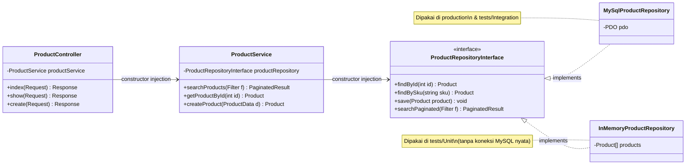
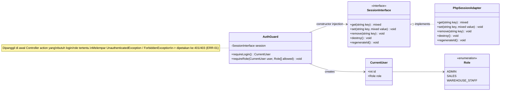
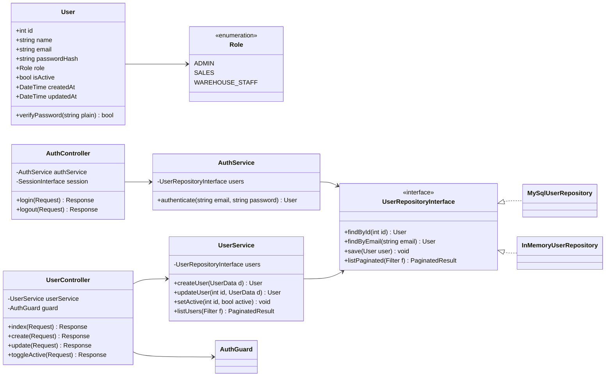
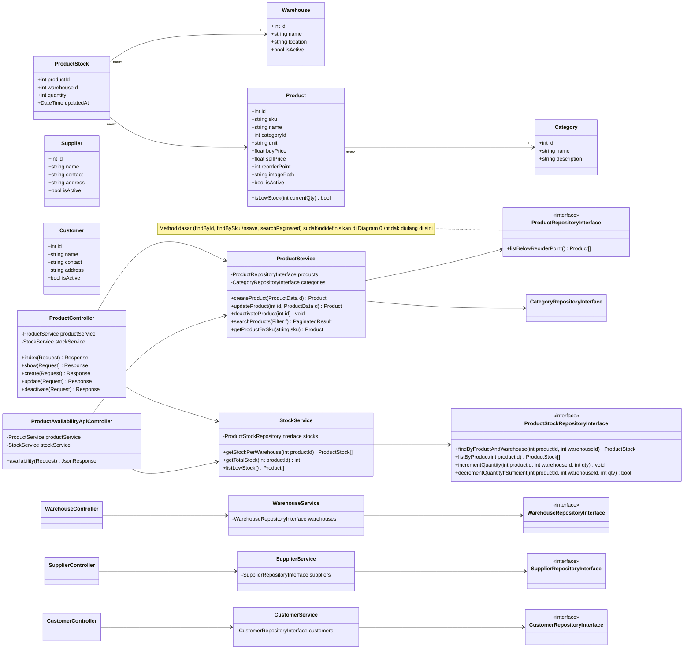
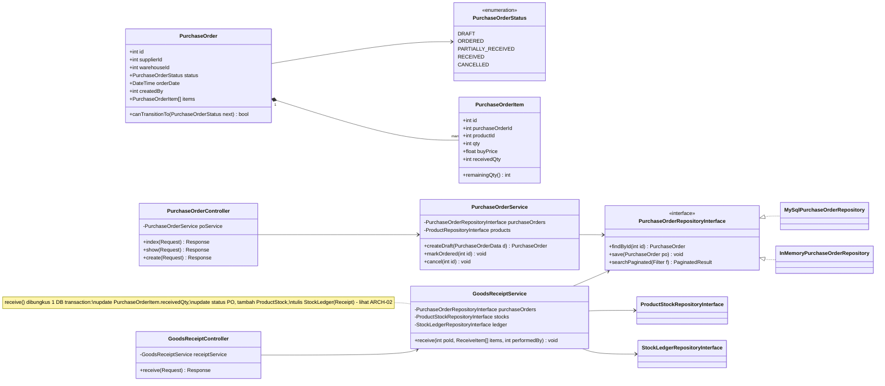
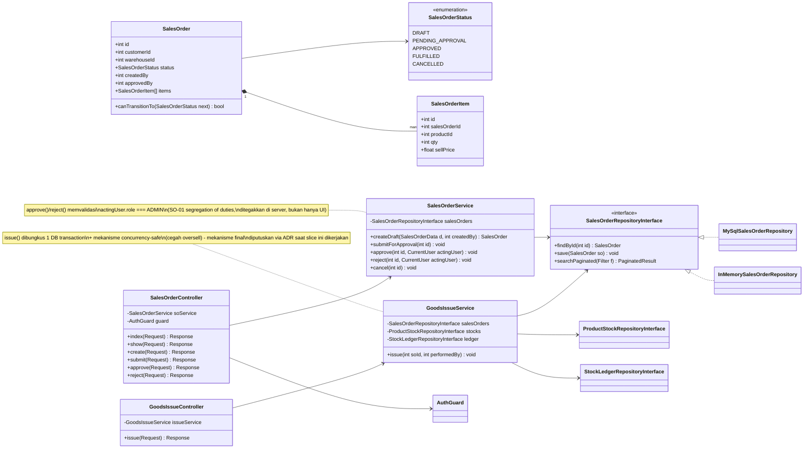
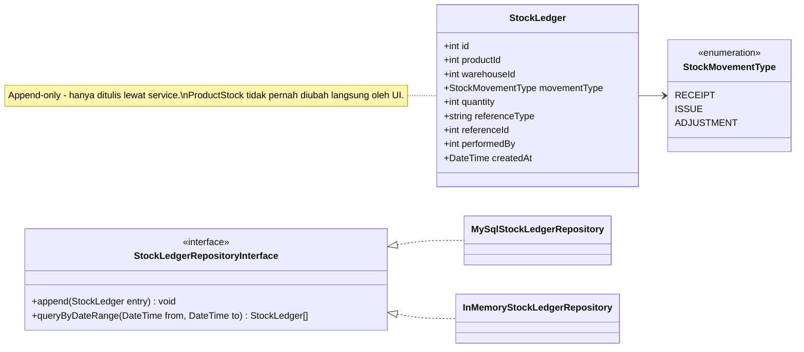
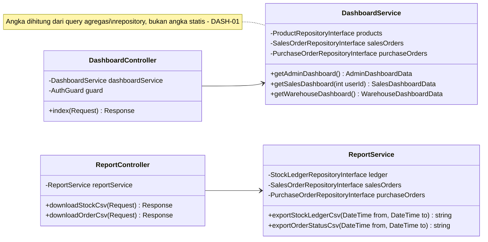

# Class Diagram - Initial (DESIGN-01)

Dibuat sebelum coding, sebagai acuan struktur Controller/Service/Repository/Entity dan relasinya. Tool: Mermaid (markdown, render otomatis di GitHub/VS Code).

Diagram dipecah per modul mengikuti urutan vertical slice di §2 project brief, supaya tetap terbaca. Modul lain mengikuti pola repository yang sama seperti didemonstrasikan pada Diagram 0 — tidak digambar ulang di tiap modul agar tidak duplikatif.

Catatan umum:
- Tipe seperti `Filter`, `ProductData`, `UserData`, `ReceiveItem`, `PaginatedResult` adalah placeholder untuk data masukan/keluaran (bisa jadi array asosiatif sederhana atau value object kecil) — bentuk final ditentukan saat coding, tidak dikunci di tahap desain ini.
- Mekanisme konkret pencegahan oversell pada `GoodsIssueService`/`ProductStockRepositoryInterface` (ARCH-02) belum difinalkan di sini — akan diputuskan dan dicatat sebagai ADR saat slice Sales Order dikerjakan.

## Diagram 0 - Pola Arsitektur & Cross-Cutting (ARCH-01)

Didemonstrasikan sekali pakai `Product` sebagai contoh. Repository lain (User, Warehouse, Category, Supplier, Customer, PurchaseOrder, SalesOrder, StockLedger, ProductStock) mengikuti pola identik: satu interface, implementasi `MySql*` untuk production/integration test, implementasi `InMemory*` untuk unit test.

Pemetaan method Controller -> Service (setiap action Controller harus punya pasangan jelas di Service, dan tidak ada method Service yang "nganggur" tanpa pemanggil — keduanya wajib 1:1 dalam satu diagram):
- `index()` -> `searchProducts(Filter f)` (filter kosong = list semua, dipaginasi)
- `show()` -> `getProductById(int id)`
- `create()` -> `createProduct(ProductData d)`

Diagram ini sengaja hanya memuat 3 action sebagai contoh pola, bukan CRUD `Product` lengkap. `update()` dan `deactivate()` (PRD-01) digambar penuh di Diagram 2 (Master Data) — tidak diulang di sini supaya tidak ada dua sumber kebenaran untuk class yang sama.

Cross-cutting: session tidak pernah diakses langsung oleh Service (ARCH-01), hanya oleh Controller lewat `AuthGuard`.

## Diagram 1 - Auth & User Management (AUTH-01, AUTH-02, USR-01)

Catatan: `AuthService.authenticate()` murni logic (cek `isActive` + `password_verify`), tidak menyentuh session -> testable dengan `InMemoryUserRepository`. Penulisan session (login) dan penghapusan session (logout) dilakukan di `AuthController` lewat `SessionInterface`.

## Diagram 2 - Master Data (PRD-01, WH-01, API-01)

Catatan:
- `ProductAvailabilityApiController` adalah controller JSON API terpisah (API-01, `GET /api/products/{sku}/availability`), memakai `StockService` yang sama dengan halaman HTML biasa — bukan logic duplikat. Alurnya: resolve SKU -> Product lewat `ProductService.getProductBySku()` (lempar `NotFoundException` -> 404 kalau SKU tidak ada), baru panggil `StockService.getStockPerWarehouse(product.id)`.
- `ProductService.createProduct()` memakai `findBySku()` di repository secara internal untuk validasi keunikan SKU (PRD-01) sebelum menyimpan — bukan method terpisah, cukup bagian dari alur `createProduct()`.
- `ProductService.getProductBySku()` juga memakai `findBySku()` di repository — dua pemanggil ini yang membuat method tersebut benar-benar terpakai (sebelumnya sempat tidak tersambung ke alur mana pun).

## Diagram 3 - Purchase Order & Goods Receipt (PO-01)

## Diagram 4 - Sales Order & Goods Issue (SO-01)

## Diagram 5 - Stock Ledger (shared core)

Dipakai bersama oleh `GoodsReceiptService` (Diagram 3) dan `GoodsIssueService` (Diagram 4).

## Diagram 6 - Dashboard & Report (DASH-01, REPORT-01)

## Di Luar Diagram (JOB-01)

`scripts/check-low-stock.php` adalah entry point CLI mandiri (bukan Controller), memanggil `StockService`/`ProductService` yang sama seperti web — membuktikan reuse business logic lintas request-cycle dan CLI.
