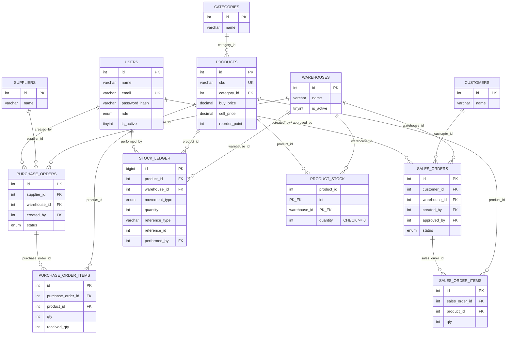

# ERD (DB-01)

Mengikuti entity di [class-diagram-initial.md](class-diagram-initial.md). Skema fisik lengkap ada di `database/schema-and-seed.sql`; diagram ini versi visualnya.

## Catatan desain (dari modul SQL)

- `product_stock` pakai composite primary key `(product_id, warehouse_id)` - satu baris per kombinasi produk+gudang, bukan `id` auto-increment sendiri, karena kombinasi itu memang unik secara alami.
- `stock_ledger` punya index composite `(product_id, warehouse_id, created_at)` - kolom equality (`product_id`, `warehouse_id`) di depan, kolom range/sort (`created_at`) di belakang, mengikuti kaidah *left-prefix* supaya laporan pergerakan stok per produk+gudang+rentang tanggal (REPORT-01) bisa pakai index ini secara efisien.
- `quantity >= 0` di-enforce lewat `CHECK` constraint di level database, bukan cuma divalidasi di PHP - lapisan pertahanan tambahan untuk ARCH-02.
- Stok tidak pernah diubah tanpa baris `stock_ledger` yang menyertainya (ditegakkan di application layer lewat transaksi, bukan trigger - lihat `docs/quality/tech-debt.md` dan alasan di modul SQL Bab 9 soal risiko trigger untuk audit log).
